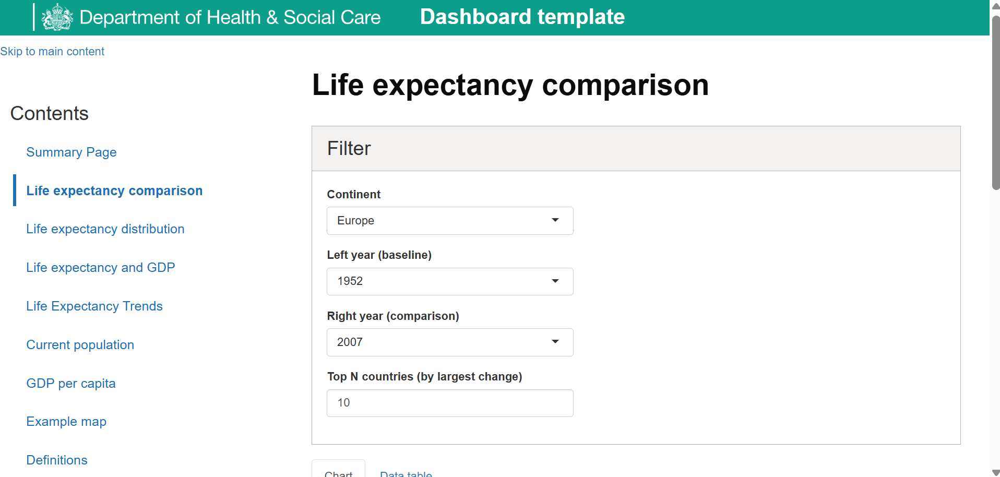
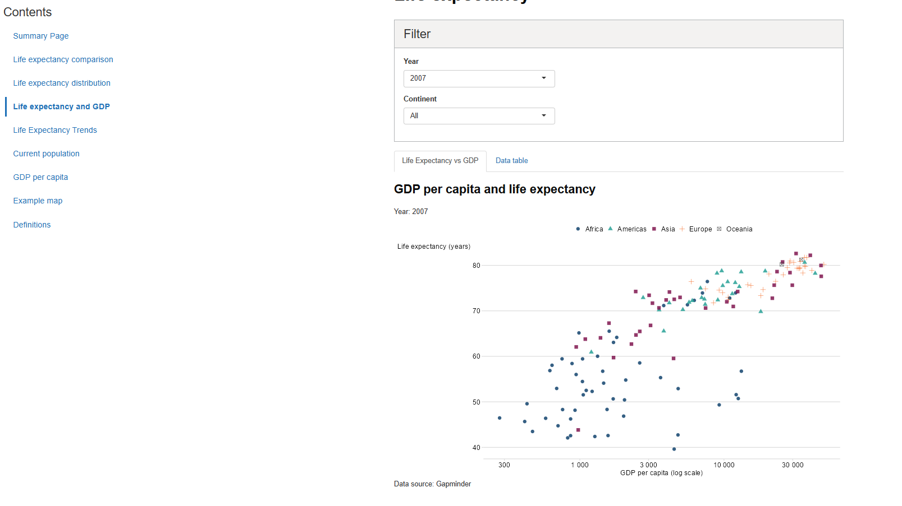
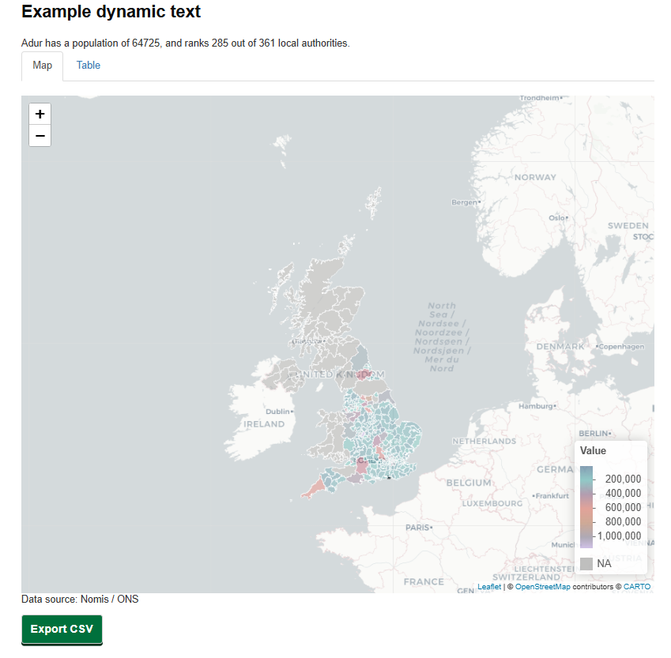

# DHSC Shiny Dashboard Template

A Shiny dashboard template demonstrating how to build accessible, GOV.UK-aligned analytical dashboards using:
- `{shinyGovstyle}` for layout and branding
- `{afcharts}` for consistent chart styling
- `{golem}` to provide a modular, production-ready structure for Shiny applications.
- Gapminder data for illustration

## Overview screenshots
Screenshot 1

Screenshot 2

Screenshot 3

## Features

- GOV.UK-style layout and components
- Accessible design (skip links, keyboard navigation)
- Consistent chart styling using AF colour palettes
- Multiple analytical views:
  - Time series
  - Distributions
  - Comparisons
  - Maps
- Download options (CSV, PNG, report)
- Filtering

## Usage

This template can be used by anyone in DHSC who wants to create a Shiny dashboard.

The main branch contains a significant amount of code, so we recommend that users start with either the skeleton_app branch or the scatter_plot_example branch which are much more compact.

### How users can get started (how to install, how to run)

Once you have cloned the repo to RStudio/VS Code, run the following four commands in the console one at a time:

install.packages("devtools")

devtools::install_deps(dependencies = TRUE)

devtools::load_all()

dhscshinytemplate::run_app()

The dashboard should then pop up in a new window. Note that each of these steps should take under a minute, aside from the second step (install_deps) which may take up to an hour, but it should show you the packages that it is installing rather than appearing frozen.

### How to set up renv (package control)
James R to complete

## Contents

-   `R/app_server.R` - a script which runs the server logic of the RShiny dashboard.
    This essentially runs the calculations of the dashboard.

-   `R/app_ui.R` - this script covers the outputs and inputs seen by the end user.
     It passes inputs to the server, which uses them to do calculations
     and produce outputs, which it passes back to the ui to show to the user. 

-   `./R`, `./input` and `./output` folders - store all code (except
    `main.R`) in the `./R` folder, input data and settings in the
    `./input` folder, and write any output from the analysis to the
    `./output` folder. Input and ouput folders contain `.gitignore`
    files which prevent their contents from being version controlled
    (with the exception of `./input/config.yaml`).

-   `DESCRIPTION` - use this script to install any packages that
    your code requires. This makes the code more portable as a new user
    of the analysis will have the required packages installed
    automatically on running the code.

-   `README.md` - this document,

-   `.gitignore` - a git ignore file that prevents certain files being
    version controlled. This will omit some standard files such as
    `.RData`, `.Rhistory`, etc.

-   `LICENSE.md` - default MIT license.
  
-   `README_template.md` a template that you can fill in to produce a README for
    your own dashboard

## Design principles

This dashboard follows GOV.UK and AF analytical design standards:

- Use of colour only where it adds meaning
- Clear hierarchy between filters, charts, and outputs
- Accessible components (skip links, keyboard navigation)
- Minimal visual clutter

## QA Status of the repo
This repo has been fully QAd by the DHSC Data Science team.

## Code of Conduct

Please note that this project is released with a [Contributor Code of
Conduct](https://dhsc-govuk-internal.github.io/user-guide.github.io/code-of-conduct.html).
By contributing to this project, you agree to abide by its terms.

## Licence

Unless stated otherwise, the codebase is released under the MIT License.
This covers both the codebase and any sample code in the documentation.
The documentation is © Crown copyright and available under the terms of
the [Open Government 3.0
licence](https://www.nationalarchives.gov.uk/doc/open-government-licence/version/3/).
